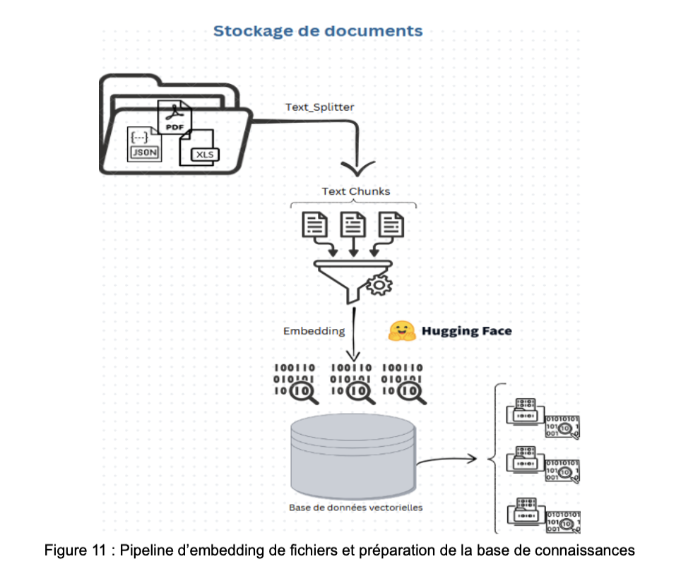

# 🧠 Local RAG-Based DBA Assistant  
### (Ollama + LangChain + ChromaDB)

A fully local Retrieval-Augmented Generation (RAG) platform designed to assist Database Administrators (DBAs) in diagnosing, understanding, and resolving database-related issues using private technical documentation.

This system operates **entirely offline**, using locally deployed Large Language Models via Ollama and a vector database for semantic retrieval.

---

## 📌 Project Objectives

- Build a fully local AI assistant for database troubleshooting  
- Enable semantic search over heterogeneous technical documents  
- Preserve data confidentiality (no external APIs)  
- Provide explainable answers with document sources  
- Demonstrate a complete RAG pipeline implementation  

---

## 🏗️ System Architecture

### 1️⃣ Document Processing & Vectorization Pipeline

This stage handles:

- Loading heterogeneous documents (PDF, XLSX, JSON, TXT)  
- Text cleaning and normalization  
- Chunking using recursive splitting  
- Embedding generation  
- Storage in ChromaDB  

---

### 2️⃣ End-to-End RAG Pipeline

The complete processing pipeline includes:

1. Data ingestion  
2. Filtering and preprocessing  
3. Chunking  
4. Vector indexing  
5. Similarity-based retrieval  
6. LLM-based answer generation  

---

### 3️⃣ User Interaction Flow

### 3️⃣ User Interaction Flow

Users interact with the system via a conversational interface powered by Chainlit.

Relevant documents are retrieved and injected into the LLM context to generate grounded responses.

---

## ⚙️ Technical Stack

| Component     | Technology                     |
|---------------|--------------------------------|
| Interface     | Chainlit                        |
| LLM           | Ollama (LLaMA3 / Mistral)        |
| Embeddings    | nomic-embed-text (local)        |
| Vector DB     | ChromaDB                        |
| Framework     | LangChain                       |
| Backend       | Python 3.11                     |

---

## 📂 Project Structure
